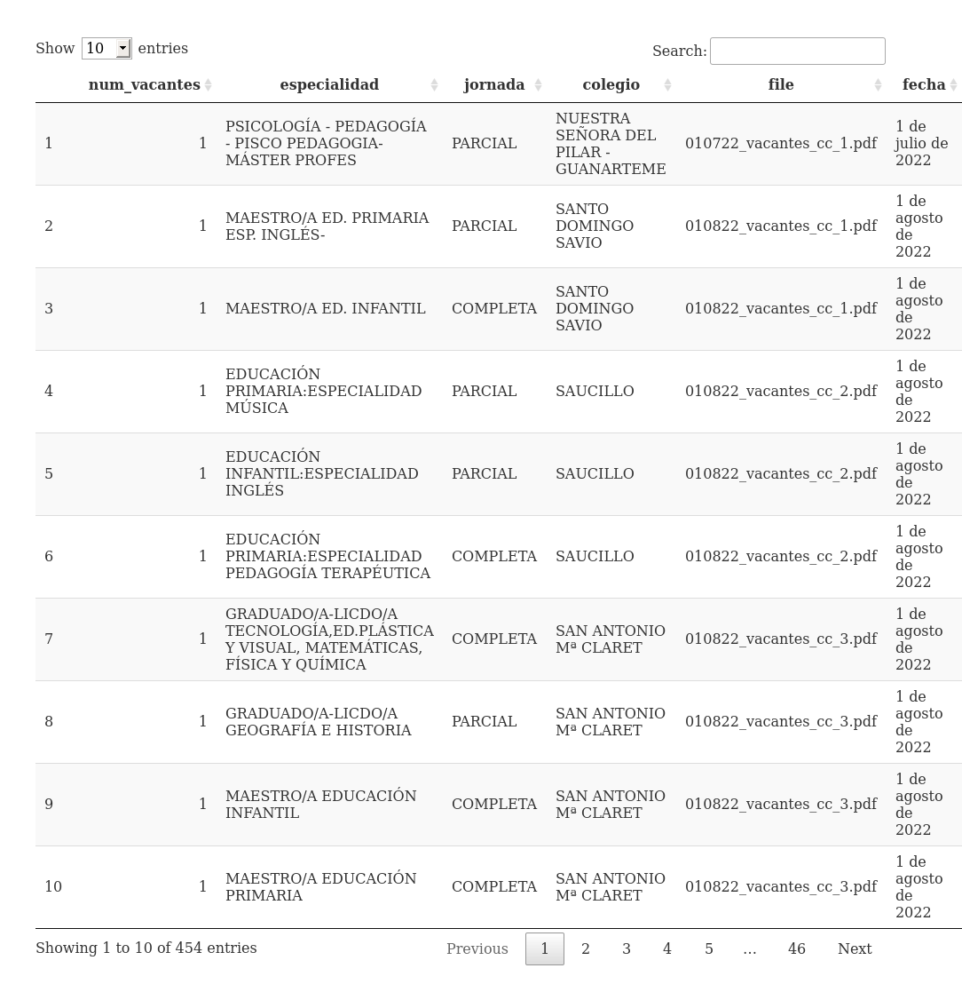

# vacantes\_concertados

<!-- badges: start -->
<!-- badges: end -->

El objetivo de este repositorio es consolidar la información de
[Vacantes en centros privados concertados del Gobierno de
Canarias](https://www.gobiernodecanarias.org/educacion/web/centros/gestion_centros/centros_privados_concertados/vacantes/)
en una tabla de fácil acceso. [Puedes ver la tabla haciendo click
aquí](https://github.com/gorkang/vacantes_concertados/blob/master/outputs/DF_ALL.csv)

------------------------------------------------------------------------

Para empezar, puedes abrir el archivo `run.R` y correr las últimas dos
líneas.

    DF_ALL = readr::read_csv("outputs/DF_ALL.csv") # Leemos archivo
    DT::datatable(DF_ALL) # Vemos tabla

